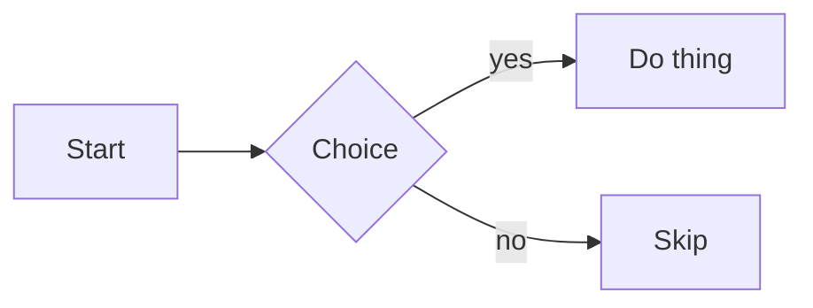

# Obsidian → Canvas Round-Trip Fixture

How to use this file:

1. Open it in Obsidian to confirm every `T##` block renders as intended (this is valid Obsidian Flavored Markdown).
2. Push its contents into a Slack canvas (your update path).
3. Download the canvas back to markdown (your download path).
4. Diff the downloaded file against this one. Every `T##` section that changed marks a rule the update→download cycle does **not** preserve.

Each block shows the raw syntax in a code span first (so the source survives as plain text and gives you a stable diff anchor), then the live construct underneath.

Legend for what each section group tests:
- **CORE** = CommonMark, should be the safest.
- **GFM** = GitHub-flavored additions.
- **OFM** = Obsidian-specific (wikilinks, embeds, callouts, etc.) — most likely to be stripped.
- **MATH** = MathJax/LaTeX.
- **NEST** = nesting/combinations, where canvas damage usually concentrates.

---

## CORE

### T01 — Headings h1–h6
Source: `# H1` … `###### H6`

# Heading 1
## Heading 2
### Heading 3
#### Heading 4
##### Heading 5
###### Heading 6

### T02 — Paragraph + hard line break
Source: two trailing spaces, or a backslash `\` at line end.

Line one with two trailing spaces  
Line two after a space break.

Line one with backslash break\
Line two after a backslash.

### T03 — Emphasis
Source: `*italic*` `**bold**` `***bold italic***`

*italic*, **bold**, ***bold italic***, and plain.

### T04 — Inline code
Source: `` `code()` ``

Here is `inline_code()` in a sentence.

### T05 — Blockquote + nested blockquote
Source: `> quote` and `>> nested`

> Level one quote.
>> Level two nested quote.
> Back to level one.

### T06 — Horizontal rule
Source: `---`

---

### T07 — Unordered list
Source: `- item`

- alpha
- beta
- gamma

### T08 — Ordered list
Source: `1. item`

1. first
2. second
3. third

### T09 — Links (inline, reference, autolink, bare)
Source: `[text](url)`, `[ref][id]`, `<url>`, bare url

Inline: [Obsidian help](https://help.obsidian.md)
Reference: [reference link][ob]
Autolink: <https://obsidian.md>
Bare: https://obsidian.md

[ob]: https://help.obsidian.md

### T10 — Image (external)
Source: ``


### T11 — Table (GFM, with alignment + inline formatting)
Source: pipe table with `:--`, `:-:`, `--:`

| Left | Center | Right |
| :--- | :----: | ----: |
| a | **bold** | 1 |
| `code` | *it* | 2 |

### T12 — Escaping
Source: `\*not italic\*`

\*not italic\* and \# not a heading.

`*fafda* fdsfsf** fafadfs *** **** fafsdfa*****fdfadfa * * afdsafdsafafafaFAFa(FAAFAFAfAfA8AFAFafafAfAFAfafaFafafafAF8afaf8AFAfafAfAf*f  *AF ar a8fAf 8A 8a a 8af a AF 8A 8 a afaF aAf aF a8 a af *a *a 8 *A *Afaf *A *A `

---

## GFM

### T13 — Strikethrough
Source: `~~struck~~`

~~struck through~~ text.

### T14 — Task list (todos), checked + unchecked
Source: `- [ ]` and `- [x]`

- [ ] open task
- [x] done task
- [ ] another open one

---

## OFM (Obsidian-specific)

### T15 — Wikilink (plain)
Source: `[[Some Note]]`

[[Some Note]]

### T16 — Wikilink with alias
Source: `[[Some Note|display text]]`

[[Some Note|display text]]

### T17 — Wikilink to heading / block
Source: `[[Note#Heading]]` and `[[Note#^blockid]]`

[[Some Note#Section Two]] and [[Some Note#^abc123]]

### T18 — Embed note / image / sized image
Source: `![[Note]]`, `![[image.png]]`, `![[image.png|200]]`

![[Some Note]]
![[image.png]]
![[image.png|200]]

### T19 — Callout (basic)
Source: `> [!note] Title`

> [!note] A note callout
> Body text of the callout.

### T20 — Callout (foldable + custom type)
Source: `> [!warning]- Foldable`

> [!warning]- Foldable warning (collapsed)
> Hidden until expanded.

### T21 — Highlight
Source: `==highlighted==`

This is ==highlighted== text.

### T22 — Comment (should not render)
Source: `%%comment%%`

Before %%this is an inline comment%% after.

### T23 — Tags (flat + nested)
Source: `#tag` and `#tag/sub`

#project #project/canvas #status/in-progress

### T24 — Footnote (referenced + inline)
Source: `[^1]` with definition, and `^[inline note]`

Referenced footnote.[^1] Inline footnote.^[this is inline]

[^1]: This is the footnote definition.

### T25 — Block reference id
Source: trailing `^blockid`

This paragraph has a block id. ^block-ref-1

---

## MATH

### T26 — Inline math
Source: `$e^{2i\pi} = 1$`

Euler: $e^{2i\pi} = 1$ inline.

### T27 — Block math
Source: `$$ ... $$`

$$
\int_0^{\infty} e^{-x^2}\,dx = \frac{\sqrt{\pi}}{2}
$$

### T28 — Matrix / determinant
Source: `\begin{vmatrix} ... \end{vmatrix}`

$$
\begin{vmatrix} a & b \\ c & d \end{vmatrix} = ad - bc
$$

### T29 — Aligned multi-line
Source: `\begin{aligned} ... \end{aligned}`

$$
\begin{aligned}
f(x) &= (x+1)^2 \\
     &= x^2 + 2x + 1
\end{aligned}
$$

### T30 — Cases + sizing delimiters
Source: `\begin{cases}`, `\left( \right)`

$$
|x| = \begin{cases} x & x \ge 0 \\ -x & x < 0 \end{cases}
\quad \left( \frac{1}{2} \right)
$$

---

## NEST (combinations — the danger zone)

### T31 — List inside list (3 levels)
Source: nested `-` with indentation

- level 1
    - level 2
        - level 3
    - back to level 2
- level 1 again

### T32 — Ordered > unordered > task
Source: mixed nesting

1. ordered one
    - bullet under ordered
        - [ ] task under bullet
        - [x] done task under bullet
2. ordered two

### T33 — Nested task list with formatting
Source: checkboxes + bold/code nested

- [ ] parent task with **bold**
    - [x] child done with `code`
        - [ ] grandchild open

### T34 — Code block inside a list item
Source: indented fenced block under `-`

- item with code:

    ```python
    def f(x):
        return x + 1   # comment with a # inside
    ```

- next item

### T35 — Blockquote containing a list containing code
Source: `>` wrapping nested structures

> quote intro
> - bullet in quote
>     ```bash
>     echo "code in list in quote"
>     ```
> quote outro

### T36 — Callout containing a list and a table
Source: callout body with block content

> [!tip] Callout with structure
> - point one
> - point two
>
> | k | v |
> | - | - |
> | a | 1 |

### T37 — Block math inside a list item
Source: `$$` indented under `-`

- step with an equation:
    $$
    \sum_{i=1}^{n} i = \frac{n(n+1)}{2}
    $$
- next step

### T38 — Inline math + wikilink inside a table cell
Source: `$...$` and `[[...]]` in cells

| Concept | Detail |
| ------- | ------ |
| Euler | $e^{i\pi}+1=0$ |
| Link | [[Some Note\|aliased]] |

### T39 — Embed + sized image inside a list
Source: `![[...|200]]` under `-`

- gallery:
    - ![[image.png|200]]
    - ![[Some Note#Section Two]]

### T40 — Mermaid diagram (Obsidian renders; canvas likely won't)
Source: ` ```mermaid `


